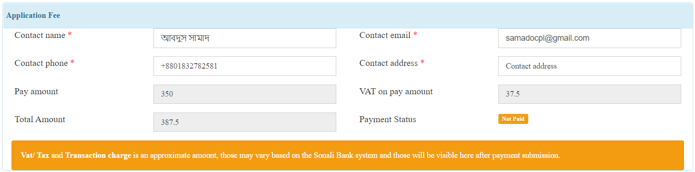
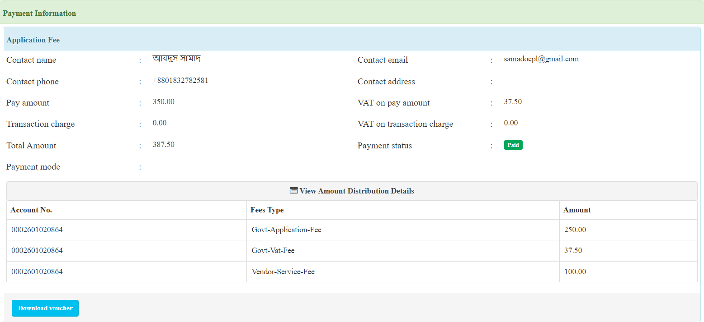

 

# Sonali Payment Integration Process


## About Sonali Payment Gateway

Sonali Payment Gateway is an online payment service provider by Sonali Bank Ltd. All types of card payment, mobile banking are available here. Also, sonali bank account holder can make a payment by using their account information.

We have developed a module for payment by Sonali Payment Gateway. It is easy to integrate with any OSS-Project.
Here we have mention each feature details about Sonali Payment module to help the developer.

## Table of Contents

- [Module Structure](#markdown-header-module-structure)
- [Prerequisites](#markdown-header-prerequisites)
- [How to integrate](#markdown-header-how-to-integrate)
    - [env configuration](#markdown-header-env-configuration)
    - [Laravel Configuration file](#markdown-header-laravel-configuration-file)
    - [Route exclude from middleware](#markdown-header-route-exclude-from-middleware)
    - [Middleware permission](#markdown-header-middleware-permission-for-payment-routes)
    - [Database Configuration](#markdown-header-database-configuration)
    - [Third-party plugin dependencies](#markdown-header-third-party-plugin-dependencies)
- [Usage](#markdown-header-usage)
    - [Sidebar menu](#markdown-header-sidebar-menu)
    - [Payment Configuration](#markdown-header-payment-configuration)
    - [Payment Create Panel](#markdown-header-payment-create-panel)
    - [Payment data store and initiate process](#markdown-header-payment-data-store-and-initiate-process)
    - [Payment View Panel](#markdown-header-payment-view-panel)
    - [Payment callback processing](#markdown-header-payment-callback-processing)
    - [Payment Invoice](#markdown-header-payment-invoice)
    - [Instant Payment Notification](#markdown-header-instant-payment-notification)
- [Contributors](#markdown-header-contributors)


## Module Structure
- **Controllers** - All controllers.
- **Database** - All db dependency (tables, data, trigger) for payment module.
- **Library** - Custom library e.g. ACL.
- **Models** - DB model.
- **resources**
    - **css** -  CSS files for payment module e.g. payment voucher.
    - **images** - All images for payment module e.g. payment voucher.
- **routes** - route files.
- **Services** - Payment related services.
- **Translation** - Localization files.
- **Views** - Blade template.
- **helper.php** - Custom common function for payment.
- **readme.md** - Details instruction about Payment Module.

**Important:** There has a Javascript file named `sonali_payment.js` inside the `resources/js` folder, that must be included in the application add, edit, and view page.

## Prerequisites
If you want to integrate Sonali Payment in any project, you will need some data from Sonali Payment Authority.

E.g.

1. Payment credential for your Development, UAT and Training server.
2. Payment credential for your Live server.
3. Valid account number of the stakeholder for payment configuration.

`Payment credential` means all payment related data of `.env` file.

## How to integrate

#### env configuration:
At first, the following variable should be declared with valid value into the `.env` file.

- `payment_mode` - it will be boolean value, `true` or `false`. Use `false` for development and testing environment.
- `spg_web_service_url` - This url will be provided by SPG and used for getting authorization session token from Sonali Payment Gateway.
- `spg_web_portal_url` - This url will be provided by SPG and used to submit payment request to SPG.
- `spg_user_id` - Valid user id for authorization to SPG.
- `spg_password` - Valid user password for authorization to SPG.
- `spg_SBL_account` - All payment amount will be deposited in that account. **But, Currently credited to the stakeholder account, this stakeholder account information is given in the payment configuration.**
- `st_code` - Just a small user-defined code or key. short code of project name is preferable.
- `request_id_prefix` - An unique id (10 digit) will be generated for every payment request. First 3 digit of this code will be provided by SPG.
- `return_url/ return_url_m` - Payment callback url. It is user defined data, you can define it as you want.
- `single_details_url` - URL for payment details checking API.

**N.B.:** For development and testing environment, `spg_SBL_account` will be provided by SPG.

#### Laravel Configuration file:
All variables those were declared into the `.env` file should be declared in a configuration file named `payment.php`. As like following:
```php
<?php

return [
    'spg_settings' => [
        'payment_mode' => env('payment_mode', 'on'),
        'web_service_url' => env('spg_web_service_url', 'https://spg.com.bd:6313/SpgService.asmx'),
        'web_portal_url' => env('spg_web_portal_url', 'https://spg.com.bd:6313/SpgRequest/PaymentByPortal'),
        'user_id' => env('spg_user_id', 'spg_user_id'),
        'password' => env('spg_password', 'spg_password'),
        'SBL_account' => env('spg_SBL_account', 'spg_SBL_account'),
        'st_code' => env('st_code', 'OSS-Framework'),
        'request_id_prefix' => env('spg_request_id_prefix', '010'),
        'return_url' => env('PROJECT_ROOT') . env('spg_callback_url', '/spg/callback'),
        'return_url_m' => env('PROJECT_ROOT') . env('spg_callback_url_m', '/spg/callbackM'),
        'single_details_url' => env('single_details_url', 'https://spg.com.bd:6313/api/SpgService/TransactionDetails')
    ]
];
```

**Note:** All environment variables have been called via configuration inside of the Payment Module, so it is required to declare all environment variables into the configuration file.  


#### Route exclude from middleware:

The payment callback route, which we declared into `.env` file as `return_url` and `return_url_m`. 
These URL need to be excluded from CSRF token verification. 
As like following:
```php
<?php

class VerifyCsrfToken extends Middleware
{
    /**
     * The URIs that should be excluded from CSRF verification.
     *
     * @var array
     */
    protected $except = [
        'spg/callback',
        'spg/callback_multiple'
    ];
}
```

#### Middleware permission for payment routes:
Generally, our OSS platform uses a common middleware named `checkAdmin`, for module-wise user permission.
If there need to add such kinds of permission, then we can add extra condition into `checkAdmin` middleware.
All routes of Sonali Payment modules start with one of the following segment:

- spg/
- ipn/

So, for all routes of Sonali Payment can be added under a condition into `checkAdmin` middleware as like as below:

```PHP
<?php

class checkAdmin
{
    /**
     * Handle an incoming request.
     *
     * @param \Illuminate\Http\Request $request
     * @param \Closure $next
     * @return mixed
     */
    public function handle($request, Closure $next)
    {
        $user_type = Auth::user()->user_type;
        $user = explode("x", $user_type);
        $uri = $request->segment(1);
        switch (true) {
            case ($uri == 'spg' and (in_array($user[0], [1, 5, 6]))):
            case ($uri == 'ipn' and (in_array($user[0], [1]))):
                return $next($request);
            default:
                Session::flash('error', 'Sorry! Unauthorized');
                return redirect('dashboard');
        }
    }
}
```

#### Database Configuration:
At first, in the `configuration` table, we have to declare 3 value:

- `SP_PAYMENT_HELPLINE_VOUCHER` - The helpline number will be printed into a payment voucher.
- `PAYMENT_PENDING_MINUTE` - Time-lapse between multiple attempts for the same payment.
- `ALLOW_IP_IPN` - This is the IP address of SPG, from where they will notify about every successful payment (IPN).

An example as below:


After the configuration setting, we need to add some tables with data and trigger into the project database.

All DB dependencies have been given into an SQL file inside of the `Database` folder as a file name of `payment_db.sql`.
Just open the file, select the query, and execute them into your database.

#### Third-party plugin dependencies:
For payment invoice generation, the following plugin need to be installed into the project:

- [milon/barcode](https://github.com/milon/barcode)
- [mpdf/mpdf](https://github.com/mpdf/mpdf)

## Usage

Let's use Sonali Payment in a module of your project.

#### Sidebar menu:
Sonali Payment Module has 3 sections, which should be displayed in the menu bar of your project.

This section and its routes are given below:

- Payment list - `/spg/list`
- Payment Configuration - `/spg/payment-configuration`
- IPN list - `/ipn/ipn-list`

#### Payment Configuration:

Sonali Payment Module is designed primarily for OSS module-based application payments. 

Suppose, you have a module ***Space Allotment***.
If you want to pay for the application of this module, you must first configure the payment. 

If you go to `www.your-project-domain/spg/payment-configuration` route, 
you will get the module based payment configuration form. 

Here, you have to provide all the information including the payment amount, stakeholder details and distribution type for ***Space Allotment*** payment.

**N.B.:** The account number of stakeholders will be provided by SPG for test purpose.


#### Payment Create Panel:
After payment configuration, now we have to display the payment create panel in our application page.

There has a javascript file with some functionality by which the payment panel in all pages will be loaded with ajax.

Let's see how the payment panel could be added into application add page:

```PHP
var unfixed_amounts = {1:0, 2:0, 3:100, 4:0, 5:15, 6:0};
loadPaymentPanel('app_id', 'process_type_id', 'payment_step_id', 'panel_display_div_id', 'applicant_name', 'email', 'mobile_no', 'address', unfixed_amounts);
```
in application page where you want to display the payment panel add the js `loadPaymentPanel` function with the following parameters:

- `app_id` applicaiton id, default null
- `process_type_id` application process type id
- `process_step_id` payment step id, e.g. 1, 2
- `panel_display_div_id` HTML div id where the payment panel will be loaded
- `applicant_name`,  `email`, `mobile_no` , `address` information for payment details

This js function will load the payment panel by calling an ajax url.

An example as below:


#### Payment data store and initiate process:

We have provided 2 Service for payment data store and payment callback processing. Please, find the following services into `Services` folder.

- `SPPaymentManager.php` - For payment data store.
- `SPAfterPaymentManager.php` - For payment callback processing.

These services have been developed by PHP Trait.

Note that, There are 2 types of the payment submission process, one from the application page, which means along with the application form, and another is separate payment form submission which is submitted after post-submission of the application.

For the **first type**, from application page payment, you can store payment data and initiate the payment easily as like below:

```PHP
<?php

class SpaceAllotmentController
{
    // attach the payment initiator service
    use SPPaymentManager;

    public function applicationStore(StoreSpaceAllotment $request)
    {
        // Application store related code goes to here
        $appData = new SpaceAllotment();
        /*.... Some other info*/
        $appData->save();
        
        // initiate payment
        $unfixed_amount_array = [
            1 => 0, // Vendor-Service-Fee
            2 => 0, // Govt-Service-Fee
            3 => 500, // Govt. Application Fee
            4 => 0, // Vendor-Vat-Fee
            5 => 0, // Govt-Vat-Fee
            6 => 0 // Govt-Vendor-Vat-Fee
        ];

        $contact_info = [
                    'contact_name' => 'name',
                    'contact_email' => 'john@gmail.com',
                    'contact_no' => '01234567895',
                    'contact_address' => 'address',
                ];
        $payment_id = $this->storeSubmissionFeeData($appData->id, 1, $contact_info, $unfixed_amount_array);
        return SonaliPaymentController::RedirectToPaymentPortal(Encryption::encodeId($payment_id));
    }
}    
```

For the **second type**, from seperate payment form, the submitted data goes to `submitPayment` function inside the `PaymentPanelController.php`. 

All the codes for the payment data store and the initiate are given there by default, you have to just calculate the unfix amount as below.:

```PHP
<?php

public function submitPayment(Request $request)
{
    try {
        DB::beginTransaction();

        $app_id = Encryption::decodeId($request->get('encoded_app_id'));
        $process_type_id = Encryption::decodeId($request->get('encoded_process_type_id'));
        $payment_step_id = Encryption::decodeId($request->get('encoded_payment_step_id'));

        $unfixed_amount_array = [
            1 => 0, // Vendor-Service-Fee
            2 => 0, // Govt-Service-Fee
            3 => 0, // Govt. Application Fee
            4 => 0, // Vendor-Vat-Fee
            5 => 0, // Govt-Vat-Fee
            6 => 0 // Govt-Vendor-Vat-Fee
        ];

        switch ($process_type_id) {
            // New Registration
            case 1:
                $ind_category_id = IndustryNew::where('id', $app_id)->value('ind_category_id');
                $industry_controller = new IndustryNewController();
                $unfixed_amount_array = $industry_controller->unfixedAmountsForGovtApplicationFee($ind_category_id, 2);
                break;
            // The calculation for new process type will go here
        }

        $contact_info = [
            'contact_name' => $request->get('contact_name'),
            'contact_email' => $request->get('contact_email'),
            'contact_no' => $request->get('contact_no'),
            'contact_address' => $request->get('address'),
        ];

        $this->process_type_id = $process_type_id;
        $payment_id = $this->storeSubmissionFeeData($app_id, $payment_step_id, $contact_info, $unfixed_amount_array);

        DB::commit();

        return SonaliPaymentController::RedirectToPaymentPortal(Encryption::encodeId($payment_id));
    } catch (\Exception $e) {
        DB::rollback();
        Session::flash('error', "Sorry something went wrong [PPC-001]");
        return redirect()->back()->withInput();
    }
}
```
#### Payment View Panel:

There has a javascript file with some functionality by which the payment panel in all pages will be loaded with ajax.

Let's see how the payment panel could be added into application add page:

```PHP
loadPaymentInfo(encoded_process_type_id, encoded_app_id, 'panel_display_div_id', 'content_loader_id');
```
in application page where you want to display the payment panel add the js `loadPaymentInfo` function with the following parameters:

- `encoded_process_type_id` encoded process type id
- `encoded_app_id` encoded application id
- `panel_display_div_id` HTML div id where the payment panel will be loaded
- `content_loader_id` an element with loading icon to indicate that the payment info loading

This js function will load the payment panel by calling an ajax url.

An example as below:


#### Payment callback processing:

When a payment is complete, callback response comes from Sonali Payment Portal. 
This callback will be processed in the payment module. You do not have to do anything at this stage. 

But, for a specific application, there may need to process some functionality, such as sending email/ SMS.

There has a central function named `applicationRelatedTasks` in the `OnlinePaymentPostProcessing` trait, where you can add your application-related functionality with a new case.
```PHP
<?php

private function applicationRelatedTasks($process_name, $process_info, $paymentInfo)
{
    $applicantEmailPhone = CommonFunction::geCompanyUsersEmailPhone($process_info->company_id);

    $appInfo = [
        'app_id' => $process_info->ref_id,
        'status_id' => $process_info->status_id,
        'process_type_id' => $process_info->process_type_id,
        'tracking_no' => $process_info->tracking_no,
        'process_type_name' => $process_name,
        'remarks' => ''
    ];

    switch ($process_info->process_type_id) {
        case 1: // New Registration
            if ($process_info->status_id === 1) {
                CommonFunction::sendEmailSMS('APP_SUBMIT', $appInfo, $applicantEmailPhone);
            }
            break;
            // The functionality for new process type will go here
    }
}

```
This function will process the corresponding task and redirect to that application view page.
You can extend those function as per your need.


#### Payment Invoice:

There have 2 (two) types of payment invoice, one for *Direct Payment* and another for *Counter Payment*.
Both invoice have been developed into the Payment Module. 

Please, find the following routes and corresponding function to controller, and you can change the voucher as your need.

```PHP
    Route::get('spg/payment-voucher/{id}', 'PaymentInvoiceController@paymentVoucher');
    Route::get('spg/counter-payment-voucher/{id}', 'PaymentInvoiceController@counterPaymentVoucher');
```

#### Instant Payment Notification:

Sonali Bank will notify to your project about every successful payment.
To know details about IPN, please see the following document:

[IPN Documentation for SBL by Habib](https://docs.google.com/document/d/1ugeg99AA_rRLlPUUWjz5CNngebfN10SfLC2Le7UKDPY/edit)  


## Contributors

- [Md. Majbah Uddin (Habib)](mailto:habib@batworld.com)
- [Foyaz Ullah Shahin](mailto:shahin@batworld.com)
- [Abdus Samad](https://github.com/samadfcibd)
