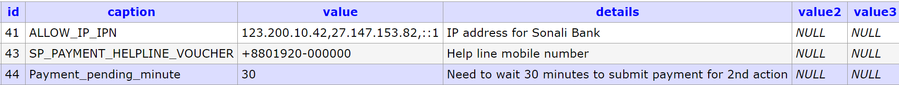

 

# Sonali Payment Integration Process


## About Sonali Payment Gateway

Sonali Payment Gateway is an online payment service provider by Sonali Bank Ltd. All types of card payment, mobile banking are available here. Also, sonali bank account holder can make a payment by using their account information.

We have developed a module for payment by Sonali Payment Gateway. It is easy to integrate with any OSS-Project.
Here we have mention each feature details about Sonali Payment module to help the developer.

## Table of Contents

- [Module Structure](#markdown-header-module-structure)
- [Prerequisites](#markdown-header-prerequisites)
- [How to integrate](#markdown-header-how-to-integrate)
    - [env configuration](#markdown-header-env-configuration)
    - [Laravel Configuration file](#markdown-header-laravel-configuration-file)
    - [Route exclude from middleware](#markdown-header-route-exclude-from-middleware)
    - [Middleware permission](#markdown-header-middleware-permission-for-payment-routes)
    - [Database Configuration](#markdown-header-database-configuration)
    - [Third-party plugin dependencies](#markdown-header-third-party-plugin-dependencies)
- [Usage](#markdown-header-usage)
    - [Sidebar menu](#markdown-header-sidebar-menu)
    - [Payment Configuration](#markdown-header-payment-configuration)
    - [Payment initiate process](#markdown-header-payment-initiate-process)
    - [Payment callback processing](#markdown-header-payment-callback-processing)
    - [Payment Invoice](#markdown-header-payment-invoice)
    - [Instant Payment Notification](#markdown-header-instant-payment-notification)
- [Contributors](#markdown-header-contributors)


## Module Structure
- **Controllers** - All controllers.
- **Database** - All db dependency (tables, data, trigger) for payment module.
- **Library** - Custom library e.g. ACL.
- **Models** - DB model.
- **resources**
    - **css** -  CSS files for payment module e.g. payment voucher.
    - **images** - All images for payment module e.g. payment voucher.
- **routes** - route files.
- **Services** - Payment related services.
- **Translation** - Localization files.
- **Views** - Blade template.
- **helper.php** - Custom common function for payment.
- **readme.md** - Details instruction about Payment Module.


## Prerequisites
If you want to integrate Sonali Payment in any project, you will need some data from Sonali Payment Authority.

E.g.

1. Payment credential for your Development, UAT and Training server.
2. Payment credential for your Live server.
3. Valid account number of the stakeholder for payment configuration.

`Payment credential` means all payment related data of `.env` file.

## How to integrate

#### env configuration:
At first, the following variable should be declared with valid value into the `.env` file.

- `SPG_PAYMENT_MODE` - it will be boolean value, `true` or `false`. Use `false` for development and testing environment.
- `SPG_WEB_SERVICE_URL` - This url will be provided by SPG and used for getting authorization session token from Sonali Payment Gateway.
- `SPG_WEB_PORTAL_URL` - This url will be provided by SPG and used to submit payment request to SPG.
- `SPG_SINGLE_DETAILS_URL` - URL for payment details checking API.
- `SPG_USER_ID` - Valid user id for authorization to SPG.
- `SPG_PASSWORD` - Valid user password for authorization to SPG.
- `SPG_SBL_ACCOUNT` - All payment amount will be deposited in that account. **But, Currently credited to the stakeholder account, this stakeholder account information is given in the payment configuration.**
- `SPG_ST_CODE` - Just a small user-defined code or key. short code of project name is preferable.
- `SPG_REQUEST_ID_PREFIX` - An unique id (10 digit) will be generated for every payment request. First 3 digit of this code will be provided by SPG.
- `SPG_CALLBACK_URL/ SPG_CALLBACK_URL_M` - Payment callback url. It is user defined data, you can define it as you want.


**N.B.:** For development and testing environment, `spg_SBL_account` will be provided by SPG.

#### Laravel Configuration file:
All variables those were declared into the `.env` file should be declared in a configuration file named `payment.php`. As like following:
```php
<?php

return [
    'spg_settings' => [
        'payment_mode' => env('SPG_PAYMENT_MODE', 'on'),
        'web_service_url' => env('SPG_WEB_SERVICE_URL', 'https://spg.com.bd:6313/SpgService.asmx'),
        'web_portal_url' => env('SPG_WEB_PORTAL_URL', 'https://spg.com.bd:6313/SpgRequest/PaymentByPortal'),
        'single_details_url' => env('SPG_SINGLE_DETAILS_URL', 'https://spg.com.bd:6313/api/SpgService/TransactionDetails'),
        'user_id' => env('SPG_USER_ID', 'spg_user_id'),
        'password' => env('SPG_PASSWORD', 'spg_password'),
        'sbl_account' => env('SPG_SBL_ACCOUNT', 'spg_SBL_account'),
        'st_code' => env('SPG_ST_CODE', 'OSS-Framework'),
        'request_id_prefix' => env('SPG_REQUEST_ID_PREFIX', '010'),
        'return_url' => env('PROJECT_ROOT') . env('SPG_CALLBACK_URL', '/spg/callback'),
        'return_url_m' => env('PROJECT_ROOT') . env('SPG_CALLBACK_URL_M', '/spg/callbackM')
    ]
];
```

**Note:** All environment variables have been called via configuration inside of the Payment Module, so it is required to declare all environment variables into the configuration file.  


#### Route exclude from middleware:

The payment callback route, which we declared into `.env` file as `return_url` and `return_url_m`. 
These URL need to be excluded from CSRF token verification. 
As like following:
```php
<?php

class VerifyCsrfToken extends Middleware
{
    /**
     * The URIs that should be excluded from CSRF verification.
     *
     * @var array
     */
    protected $except = [
        'spg/callback',
        'spg/callback_multiple'
    ];
}
```

#### Middleware permission for payment routes:
Generally, our OSS platform uses a common middleware named `checkAdmin`, for module-wise user permission.
If there need to add such kinds of permission, then we can add extra condition into `checkAdmin` middleware.
All routes of Sonali Payment modules start with one of the following segment:

- spg/
- ipn/

So, for all routes of Sonali Payment can be added under a condition into `checkAdmin` middleware as like as below:

```PHP
<?php

class checkAdmin
{
    /**
     * Handle an incoming request.
     *
     * @param \Illuminate\Http\Request $request
     * @param \Closure $next
     * @return mixed
     */
    public function handle($request, Closure $next)
    {
        $user_type = Auth::user()->user_type;
        $user = explode("x", $user_type);
        $uri = $request->segment(1);
        switch (true) {
            case ($uri == 'spg' and (in_array($user[0], [1, 5, 6]))):
            case ($uri == 'ipn' and (in_array($user[0], [1]))):
                return $next($request);
            default:
                Session::flash('error', 'Sorry! Unauthorized');
                return redirect('dashboard');
        }
    }
}
```

#### Database Configuration:
At first, in the `configuration` table, we have to declare 3 value:

- `SP_PAYMENT_HELPLINE_VOUCHER` - The helpline number will be printed into a payment voucher.
- `PAYMENT_PENDING_MINUTE` - Time-lapse between multiple attempts for the same payment.
- `ALLOW_IP_IPN` - This is the IP address of SPG, from where they will notify about every successful payment (IPN).

An example as below:



After the configuration setting, we need to add some tables with data and trigger into the project database.

All DB dependencies have been given into an SQL file inside of the `Database` folder as a file name of `payment_db.sql`.
Just open the file, select the query, and execute them into your database.

#### Third-party plugin dependencies:
For payment invoice generation, the following plugin need to be installed into the project:

- [milon/barcode](https://github.com/milon/barcode)
- [mpdf/mpdf](https://github.com/mpdf/mpdf)

## Usage

Let's use Sonali Payment in a module of your project.

#### Sidebar menu:
Sonali Payment Module has 3 sections, which should be displayed in the menu bar of your project.

This section and its routes are given below:

- Payment list - `/spg/list`
- Payment Configuration - `/spg/payment-configuration`
- IPN list - `/ipn/ipn-list`

#### Payment Configuration:

Sonali Payment Module is designed primarily for OSS module-based application payments. 

Suppose, you have a module ***Space Allotment***.
If you want to pay for the application of this module, you must first configure the payment. 

If you go to `www.your-project-domain/spg/payment-configuration` route, 
you will get the module based payment configuration form. 

Here, you have to provide all the information including the payment amount, stakeholder details and distribution type for ***Space Allotment*** payment.

**N.B.:** The account number of stakeholders will be provided by SPG for test purpose.

#### Payment initiate process:

After payment configuration, now we can integrate payment for the ***Space Allotment*** application.

We have provided 2 Service for payment initiate and payment callback. Please, find the following services into `Services` folder.

- `SPPaymentManager.php` - For payment initiate.
- `SPAfterPaymentManager.php` - For payment callback.

These services have been developed by PHP Trait. 
You can initiate the payment easily as like below:

```PHP
<?php

class SpaceAllotmentController
{
    // attach the payment initiator service
    use SPPaymentManager;

    public function applicationStore(StoreSpaceAllotment $request)
    {
        // Application store related code goes to here
        $appData = new SpaceAllotment();
        /*.... Some other info*/
        $appData->save();

        
        // initiate payment
        $unfixed_amount_array = [
            1 => 0, // Vendor-Service-Fee
            2 => 0, // Govt-Service-Fee
            3 => 500, // Govt. Application Fee
            4 => 0, // Vendor-Vat-Fee
            5 => 0, // Govt-Vat-Fee
            6 => 0 // Govt-Vendor-Vat-Fee
        ];
        // This function are located in SPPaymentManager.
        // You just send the application data, payment category id 
        // and an array of unfix amounts as function parameter, nothing else.
        // After getting the payment id, just redirect to the payment initiate route.
        $payment_id = $this->storeSubmissionFeeData($appData, 1, $unfixed_amount_array);
        return redirect('spg/initiate-multiple/' . Encryption::encodeId($payment_id));
    }
}    
```

#### Payment callback processing:

When a payment is complete, callback response comes from Sonali Payment Portal. 
This callback will be processed in the payment module. You do not have to do anything at this stage. 

At the end of this processing, payment module will return a response to the specific route of the corresponding module (***Space Allotment***) for application related processing.

This callback route will generate dynamically from the payment module in a specific pattern. 
Since this system has 2 types of payments, *direct payments* and *counter payments*. 
Therefore, two route need to be defined to receive the callback in the module (***Space Allotment***) to which the payment will be integrated.

Since we have assumed that we are integrating payments into the ***Space Allotment*** module.
So, we have to define the following two routes for receiving payment callback of ***Space Allotment*** application:

```PHP
    Route::get('space-allotment/afterPayment/{payment_id}', 'SpaceAllotmentController@afterPayment');
    Route::get('space-allotment/afterCounterPayment/{payment_id}', 'SpaceAllotmentController@afterCounterPayment');
```

In the `SpaceAllotmentController`, callback functions will use the `SPAfterPaymentManager.php` service. 
As like following:

```PHP
<?php

class SpaceAllotmentController
{
    // attach the payment initiator service
    use SPAfterPaymentManager;

    public function afterPayment($payment_id)
    {
        // This function are located in SPAfterPaymentManager. 
        $this->paymentCallBackDataStore($payment_id);
    }

    public function afterCounterPayment($payment_id)
    {
        // This function are located in SPAfterPaymentManager.
        $this->counterPaymentCallBackDataStore($payment_id);
    }
}  
```

The `paymentCallBackDataStore` and `counterPaymentCallBackDataStore` function will process the corresponding task and redirect to that application view page.
You can extend those function as per your need.


#### Payment Invoice:

There have 2 (two) types of payment invoice, one for *Direct Payment* and another for *Counter Payment*.
Both invoice have been developed into the Payment Module. 

Please, find the following routes and corresponding function to controller, and you can change the voucher as your need.

```PHP
    Route::get('spg/payment-voucher/{id}', 'PaymentInvoiceController@paymentVoucher');
    Route::get('spg/counter-payment-voucher/{id}', 'PaymentInvoiceController@counterPaymentVoucher');
```

#### Instant Payment Notification:

Sonali Bank will notify to your project about every successful payment.
To know details about IPN, please see the following document:

[IPN Documentation for SBL by Habib](https://docs.google.com/document/d/1ugeg99AA_rRLlPUUWjz5CNngebfN10SfLC2Le7UKDPY/edit)  


## Contributors

- [Dr. Md. Mazharul Haque](mailto:mazharul@batworld.com)
- [Md. Majbah Uddin (Habib)](mailto:habib@batworld.com)
- [Foyaz Ullah Shahin](mailto:shahin@batworld.com)
- [Abdus Samad](https://github.com/samadfcibd)
